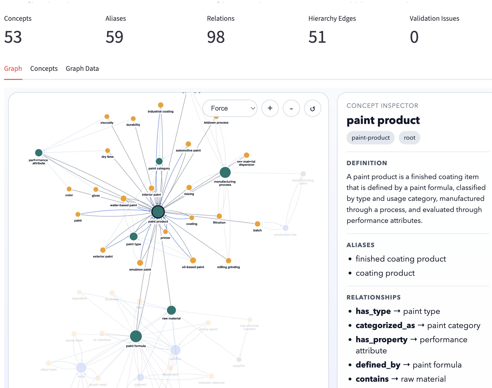

# Markdown Ontology Runtime

<table>
  <tr>
    <td valign="top">
      <p><strong>MOR</strong> is an open-source ontology runtime for LLM applications.</p>
      <p>It gives AI agents and RAG systems a semantic layer between raw user language and model prompts, retrieval, and tool execution.</p>
      <p>Instead of hoping the model interprets domain language correctly every time, MOR lets you define the domain explicitly in versioned markdown, validate it, and use it at runtime for resolution, expansion, scaffolding, explainability, MCP publishing, and evaluation.</p>
    </td>
    <td valign="top" align="right" width="48%">
      
    </td>
  </tr>
</table>

## Why MOR

LLMs are strong at language generation, but weak at maintaining stable domain semantics over time.

They do not naturally guarantee:

- consistent terminology
- explicit concept boundaries
- reliable synonym handling
- typed domain relationships
- predictable answer structure
- explainable reasoning traces

That gap becomes visible as soon as you build systems for real business domains:

- enterprise knowledge assistants
- agentic workflows
- domain-specific copilots
- search and retrieval over messy internal language
- operational reasoning over plants, products, suppliers, formulas, policies, contracts, incidents, and processes

MOR solves that by making your domain model first-class.

## Why Ontology Improves LLM Systems

An ontology works better than prompt-only or embedding-only approaches when the problem is semantic precision, not just text similarity.

### 1. Canonical meaning beats surface wording

Users ask for the same thing in many ways.

`async consistency`, `eventual state convergence`, and `eventual consistency` should not be treated as unrelated strings. MOR maps them to a canonical concept and uses that concept consistently across the runtime.

### 2. Typed relationships improve reasoning

Embeddings can tell you that two things are similar. They do not tell you whether one:

- contains another
- is supplied by another
- defines another
- is part of another
- should not be confused with another

MOR captures those relationships explicitly, which makes query expansion, answer scaffolding, and explainability much more reliable.

### 3. Controlled expansion is safer than blind expansion

A pure semantic search system often expands a query with terms that are merely nearby in vector space. That is often too loose for enterprise use.

MOR expands queries through governed domain relationships:

- `product -> defined_by -> formula`
- `formula -> contains -> raw material`
- `supplier -> supplies -> raw material`

That produces expansion that is interpretable, reviewable, and version-controlled.

### 4. Structured answers reduce drift

When an ontology defines answer requirements, the model has a better chance of producing answers that are complete and aligned with the domain:

- definition
- mechanism
- tradeoffs
- comparison
- constraints

This is especially useful for agent responses, operational explainers, and domain Q&A systems.

### 5. Explainability becomes possible

MOR can show:

- which concept matched a user term
- which relationships expanded the query
- which scaffold shaped the answer

That is much easier to inspect and debug than opaque prompt chains.

## When You Should Use MOR

MOR is a strong fit when:

- your domain has lots of synonyms, abbreviations, or overloaded terms
- the business uses internal language that public models do not know well
- you need stable terminology across prompts, retrieval, and answers
- you want explainable query expansion
- you need versioned semantic governance in Git
- your agent or RAG system must reason over entities and relationships, not just documents
- your prompts need structured answer requirements
- you want to expose the ontology to tools, APIs, or MCP clients

Typical domains:

- manufacturing
- supply chain
- healthcare operations
- finance and risk
- legal and compliance
- internal enterprise architecture
- support and service workflows

## When You Probably Should Not Use MOR

Do not add ontology for its own sake.

MOR is probably unnecessary if:

- your use case is a simple FAQ bot
- the domain language is already clean and unambiguous
- document retrieval alone is sufficient
- you do not need explainability or semantic governance
- your team will not maintain the ontology over time

If there is no real semantic ambiguity, a lighter solution is usually better.

## What MOR Gives You

- Markdown-native ontology authoring in Git
- Configurable ontology structures by version
- Strict parsing and validation
- Canonical term resolution
- Typed relationship graphs
- Query expansion using governed concept links
- Answer scaffold generation
- FastAPI service layer
- CLI workflows
- MCP server support
- Streamlit ontology explorer
- Evaluation harness and Langfuse integration

## Explorer

The ontology explorer renders the runtime graph as an interactive knowledge graph with concept inspection and MCP visibility.


The screenshot above shows MOR rendering the `paint` ontology as a navigable concept graph, with the selected node exposing its definition, aliases, relationships, inferred relationships, and source file.

## How It Works

```text
Markdown concept files
        ↓
Structure-aware parser
        ↓
Semantic runtime model
        ↓
Validator
        ↓
Runtime services
        ↓
CLI / API / MCP / Explorer / Eval
```

Each ontology area is versioned, and each version points to its own structure definition.

```text
ontology/
  structure/
    markdown-concept-v1.json
    markdown-concept-v2.json
  paint/
    V1/
      ontology.json
      *.md
```

That means you can evolve authoring standards without breaking the entire repository layout.

## Example: Why This Matters

### Better Example: Multi-hop Manufacturing Query

Suppose a user asks:

> Which raw materials most strongly affect drying time in water-based exterior primers?

This is much harder than the previous kind of query.

The answer requires understanding multiple domain relationships.

### 1. What a Vanilla RAG System Sees

A retriever finds documents mentioning:

- drying time
- primer
- water based paint
- additives
- resins

The LLM must infer relationships like:

- `drying time <- performance attribute`
- `performance attribute <- influenced by formulation`
- `formulation <- raw materials`

But none of these relationships are explicit.

So the LLM guesses.

Typical answer:

> Drying time in water-based primers is influenced by resins, solvents, and additives.

This answer is generic and shallow.

### 2. What MOR Makes Explicit

The ontology contains structured domain knowledge.

Concept hierarchy:

```text
Paint Product
  └── Primer
        └── Exterior Primer
```

Material relationships:

```text
Paint Product
   defined_by → Paint Formula

Paint Formula
   contains → Raw Material
```

Material types:

```text
Raw Material
   ├── Resin
   ├── Pigment
   ├── Solvent
   └── Additive
```

Performance attributes:

```text
Performance Attribute
   ├── Viscosity
   ├── Dry Time
   └── Durability
```

Functional relationships:

- `Resin` affects film formation
- `Solvent` affects evaporation rate
- `Additive` affects drying behavior

### 3. How the MOR MCP Workflow Happens

Step 1: Resolve query terms

Tool:

- `resolve_term`

Input:

- `drying time`
- `water-based`
- `exterior primer`
- `raw materials`

Output:

- `Dry Time -> Performance Attribute`
- `Water-Based Paint -> Paint Type`
- `Exterior Primer -> Paint Product`
- `Raw Material -> Ingredient Class`

Now the system understands the domain entities.

Step 2: Expand the query

Tool:

- `expand_query`

Expansion uses ontology relationships:

- `Dry Time` influenced by:
- `Resin`
- `Solvent`
- `Additive`

Now the semantic query becomes:

> Which resin, solvent, or additive components in water-based exterior primers influence dry time?

This is far more precise than the original query.

Step 3: Traverse relationships

Tool:

- `get_related_concepts`

Example results:

- `Dry Time influenced_by -> Solvent`
- `Dry Time influenced_by -> Additive`
- `Film Formation influenced_by -> Resin`

This reveals mechanistic relationships.

Step 4: Compute coverage

Tool:

- `compute_query_coverage`

Output:

- `covered_concepts`
- `Exterior Primer`
- `Dry Time`
- `Raw Material`
- `expanded_concepts`
- `Solvent`
- `Resin`
- `Additive`

The model knows the ontology can support the query.

### 4. Final Ontology-Guided Answer

Now the LLM answers using structured knowledge.

Example answer:

Drying time in water-based exterior primers is primarily influenced by three classes of raw materials:

`Resins (Binders)`
  Acrylic resins form the paint film and influence how quickly the coating sets after application.

`Solvents (Water and co-solvents)`
  The evaporation rate of water and co-solvents directly affects drying speed.

`Additives`
  Drying agents, coalescing agents, and rheology modifiers can accelerate or delay film formation.

## Quick Start

```bash
python3 -m venv .venv
source .venv/bin/activate
pip install -e '.[dev,ui,eval]'
```

Validate an ontology:

```bash
mor validate --ontology-root ontology --area paint --version V1
```

Resolve a term:

```bash
mor resolve "latex paint" --ontology-root ontology --area paint --version V1
```

Expand a query:

```bash
mor expand "epoxy coating formula and raw materials" --ontology-root ontology --area paint --version V1
```

Generate an answer scaffold:

```bash
mor scaffold \
  --intent architecture_explanation \
  --query "Explain how paint formula connects product and raw material" \
  --ontology-root ontology \
  --area paint \
  --version V1
```

Launch the explorer:

```bash
mor-explorer
```

Run the API:

```bash
uvicorn mor.api:app --reload
```

Run the MCP server:

```bash
mor serve-mcp
```

## Authoring Model

MOR ontologies are authored as markdown concept files.

Example:

```markdown
# Concept: Paint Product

## Canonical
paint product

## Type
entity

## Aliases
- finished coating product
- coating product

## Definition
A finished coating item defined by a paint formula, classified by type and usage category, manufactured through a process, and evaluated through performance attributes.

## Related
- type: defined_by
  concept: paint formula
- type: has_type
  concept: paint type
- type: categorized_as
  concept: paint category
- type: has_property
  concept: performance attribute
- type: contains
  concept: raw material

## Parents
- product

## QueryHints
- boost: coating
- boost: formula

## AnswerRequirements
- definition
- relationship to formula
- relationship to raw materials
- manufacturing context
```

The structure itself is configurable. Different ontology versions can use different schemas via the files under [ontology/structure](ontology/structure).

## Runtime Surface

### CLI

```bash
mor validate
mor resolve "term"
mor expand "query"
mor scaffold --intent architecture_explanation
mor stats
mor benchmark
```

### REST API

- `GET /concepts`
- `GET /concepts/{id}`
- `POST /resolve`
- `POST /expand`
- `POST /validate`
- `POST /scaffold`
- `GET /stats`

### MCP Server

Resources:

- `ontology://index`
- `ontology://concept/{id}`

Tools:

- `resolve_term`
- `expand_query`
- `validate_ontology`
- `build_answer_scaffold`

Prompts:

- `ontology_guided_architecture_answer`
- `concept_comparison`

## Evaluation

MOR includes an evaluation harness for comparing baseline versus ontology-assisted behavior across:

- concept resolution success
- ontology coverage
- answer completeness
- terminology consistency

It also supports Langfuse-backed experiments for LLM evaluation workflows.

Sample eval dataset:

- [examples/evals/paint-v2-eval.json](examples/evals/paint-v2-eval.json)

Dry-run example:

```bash
mor eval-llm \
  --dataset-path examples/evals/paint-v2-eval.json \
  --ontology-root ontology \
  --area paint \
  --version V1 \
  --mode ontology_assisted \
  --provider mock \
  --dry-run
```

## Why Developers Like MOR

- It is plain markdown, not a heavyweight ontology platform.
- It is Git-native and reviewable.
- It adds semantic control without forcing a specific model vendor.
- It works well with agents, RAG, APIs, and MCP clients.
- It gives you a practical bridge between human domain modeling and LLM runtime behavior.

## Documentation

- [docs/architecture.md](docs/architecture.md)
- [docs/ontology-format.md](docs/ontology-format.md)
- [ontology/structure/readme.md](ontology/structure/readme.md)

## Contributing

If you are building domain-aware AI systems and want a lighter-weight alternative to hardcoded prompt logic or opaque retrieval behavior, MOR is designed for exactly that class of problem.
